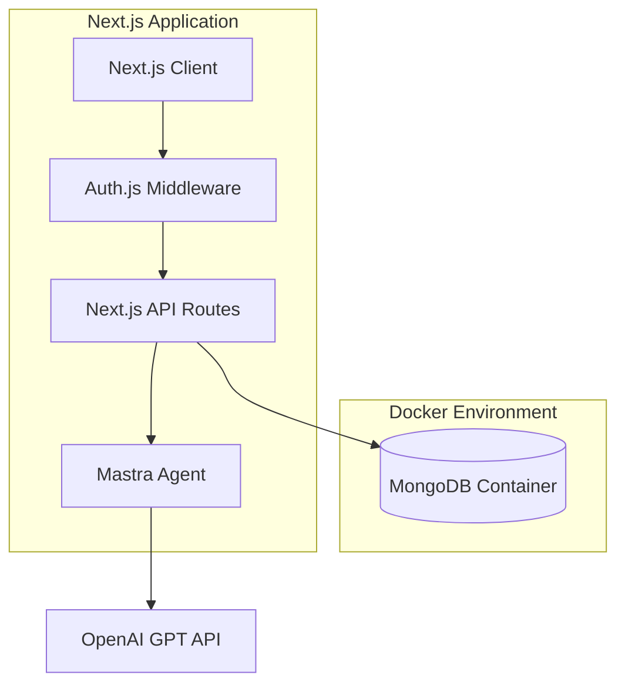

# Design Document

## Overview

Next.js、Mastra、MongoDB、Auth.jsを使用したAIエージェントチャットアプリケーションの設計書です。フルスタックNext.jsアプリケーションとして構築し、API routeにMastraを統合してOpenAI GPTとの通信を実現、MongoDBでデータ永続化、Auth.jsで認証機能を提供します。SSE（Server-Sent Events）を使用してリアルタイムストリーミングチャット体験を実現します。

## Architecture

### System Architecture



### Technology Stack

- **Frontend**: Next.js 15 (App Router)
- **Authentication**: Auth.js v5 with MongoDB Adapter
- **AI Integration**: Mastra framework with OpenAI provider + Custom Tools
- **Database**: MongoDB (Docker container)
- **Streaming**: Server-Sent Events (SSE)
- **Styling**: Tailwind CSS

## Components and Interfaces

### 1. Authentication Layer

#### Credentials Provider Configuration

Auth.js v5でCredentials Providerを使用し、MongoDBにユーザー情報を保存します。

```typescript
// auth.config.ts (Edge compatible)
import Credentials from "next-auth/providers/credentials"
import type { NextAuthConfig } from "next-auth"
import bcrypt from "bcryptjs"
import client from "./lib/mongodb"

export default { 
  providers: [
    Credentials({
      name: "credentials",
      credentials: {
        email: { label: "Email", type: "email" },
        password: { label: "Password", type: "password" }
      },
      async authorize(credentials) {
        if (!credentials?.email || !credentials?.password) {
          return null
        }

        const db = client.db("chatapp")
        const users = db.collection("users")
        
        const user = await users.findOne({ 
          email: credentials.email as string 
        })

        if (!user) {
          return null
        }

        const isPasswordValid = await bcrypt.compare(
          credentials.password as string,
          user.password
        )

        if (!isPasswordValid) {
          return null
        }

        return {
          id: user._id.toString(),
          email: user.email,
          name: user.name,
        }
      }
    })
  ],
  pages: {
    signIn: "/auth/signin",
    signUp: "/auth/signup",
  }
} satisfies NextAuthConfig
```

```typescript
// auth.ts (Full configuration with database)
import NextAuth from "next-auth"
import { MongoDBAdapter } from "@auth/mongodb-adapter"
import client from "./lib/mongodb"
import authConfig from "./auth.config"

export const { auth, handlers, signIn, signOut } = NextAuth({
  adapter: MongoDBAdapter(client),
  session: { strategy: "jwt" }, // Edge compatibility
  callbacks: {
    authorized: async ({ auth }) => {
      return !!auth // Require authentication for protected routes
    },
    jwt: async ({ token, user }) => {
      if (user) {
        token.id = user.id
      }
      return token
    },
    session: async ({ session, token }) => {
      if (token) {
        session.user.id = token.id as string
      }
      return session
    },
  },
  ...authConfig,
})
```

#### Middleware Setup (Edge Compatible)
```typescript
// middleware.ts
import authConfig from "./auth.config"
import NextAuth from "next-auth"

const { auth } = NextAuth(authConfig)

export default auth(async function middleware(req) {
  // Custom middleware logic can be added here
  return
})

export const config = {
  matcher: ["/((?!api/auth|_next/static|_next/image|favicon.ico).*)"],
}
```

### 2. Mastra Integration

#### Mastra Configuration with Tools
```typescript
// lib/tools/current-time.ts
import { Tool } from "@mastra/core"

export class CurrentTimeTool extends Tool {
  name = "getCurrentTime"
  description = "現在の日時を取得します"
  
  parameters = {
    type: "object",
    properties: {
      timezone: {
        type: "string",
        description: "タイムゾーン (例: Asia/Tokyo, UTC)",
        default: "Asia/Tokyo"
      }
    }
  }

  async execute({ timezone = "Asia/Tokyo" }: { timezone?: string }) {
    const now = new Date()
    const formatter = new Intl.DateTimeFormat("ja-JP", {
      timeZone: timezone,
      year: "numeric",
      month: "2-digit",
      day: "2-digit",
      hour: "2-digit",
      minute: "2-digit",
      second: "2-digit",
      weekday: "long"
    })
    
    return {
      currentTime: formatter.format(now),
      timezone,
      timestamp: now.toISOString()
    }
  }
}
```

```typescript
// lib/mastra.ts
import { Mastra } from "@mastra/core"
import { OpenAI } from "@mastra/openai"
import { CurrentTimeTool } from "./tools/current-time"

export const mastra = new Mastra({
  agent: {
    name: "ChatAgent",
    instructions: `あなたは親切なAIアシスタントです。明確で簡潔な回答を提供してください。
    現在時刻が必要な場合は、getCurrentTimeツールを使用してください。
    日本語で自然に会話してください。`,
    model: new OpenAI.ChatCompletion({
      model: "gpt-4o",
      apiKey: process.env.OPENAI_API_KEY!,
    }),
    tools: [new CurrentTimeTool()],
  },
})
```

#### Chat API Route with Streaming
```typescript
// app/api/chat/route.ts
import { mastra } from "@/lib/mastra"
import { auth } from "@/auth"
import { saveChatMessage } from "@/lib/chat-service"

export async function POST(req: Request) {
  const session = await auth()
  if (!session?.user?.id) {
    return new Response("Unauthorized", { status: 401 })
  }

  const { messages } = await req.json()
  
  // Save user message to database
  const userMessage = messages[messages.length - 1]
  await saveChatMessage(session.user.id, userMessage)
  
  // Get Mastra agent and create stream
  const agent = mastra.getAgent("ChatAgent")
  const stream = await agent.stream(messages)
  
  // Return AI SDK compatible streaming response
  return stream.toDataStreamResponse()
}
```

#### User Registration API Route
```typescript
// app/api/auth/register/route.ts
import { createUser } from "@/lib/user-service"
import { NextRequest } from "next/server"

export async function POST(req: NextRequest) {
  try {
    const { name, email, password } = await req.json()
    
    // Basic validation
    if (!name || !email || !password) {
      return Response.json(
        { error: "Missing required fields" },
        { status: 400 }
      )
    }
    
    if (password.length < 6) {
      return Response.json(
        { error: "Password must be at least 6 characters" },
        { status: 400 }
      )
    }
    
    const userId = await createUser({ name, email, password })
    
    return Response.json(
      { message: "User created successfully", userId },
      { status: 201 }
    )
  } catch (error) {
    if (error instanceof Error && error.message === "User already exists") {
      return Response.json(
        { error: "User already exists" },
        { status: 409 }
      )
    }
    
    console.error("Registration error:", error)
    return Response.json(
      { error: "Internal server error" },
      { status: 500 }
    )
  }
}
```

#### Alternative SSE Implementation (if needed)
```typescript
// app/api/chat-sse/route.ts
import { mastra } from "@/lib/mastra"
import { auth } from "@/auth"

export async function POST(req: Request) {
  const session = await auth()
  if (!session?.user?.id) {
    return new Response("Unauthorized", { status: 401 })
  }

  const { messages } = await req.json()
  
  const encoder = new TextEncoder()
  const stream = new ReadableStream({
    async start(controller) {
      try {
        const agent = mastra.getAgent("ChatAgent")
        const agentStream = await agent.stream(messages)
        
        // Process the stream and send SSE events
        const reader = agentStream.getReader()
        
        while (true) {
          const { done, value } = await reader.read()
          if (done) break
          
          const sseData = `data: ${JSON.stringify(value)}\n\n`
          controller.enqueue(encoder.encode(sseData))
        }
        
        controller.enqueue(encoder.encode("data: [DONE]\n\n"))
        controller.close()
      } catch (error) {
        controller.error(error)
      }
    }
  })

  return new Response(stream, {
    headers: {
      'Content-Type': 'text/event-stream',
      'Cache-Control': 'no-cache',
      'Connection': 'keep-alive',
    },
  })
}
```

### 3. Database Layer

#### MongoDB Client Setup
```typescript
// lib/mongodb.ts
import { MongoClient, ServerApiVersion } from "mongodb"

if (!process.env.MONGODB_URI) {
  throw new Error('Missing environment variable: "MONGODB_URI"')
}

const uri = process.env.MONGODB_URI
const options = {
  serverApi: {
    version: ServerApiVersion.v1,
    strict: true,
    deprecationErrors: true,
  },
}

let client: MongoClient

if (process.env.NODE_ENV === "development") {
  let globalWithMongo = global as typeof globalThis & {
    _mongoClient?: MongoClient
  }

  if (!globalWithMongo._mongoClient) {
    globalWithMongo._mongoClient = new MongoClient(uri, options)
  }
  client = globalWithMongo._mongoClient
} else {
  client = new MongoClient(uri, options)
}

export default client
```

#### User Service
```typescript
// lib/user-service.ts
import client from "./mongodb"
import { ObjectId } from "mongodb"
import bcrypt from "bcryptjs"

export interface User {
  _id?: ObjectId
  name: string
  email: string
  password: string
  createdAt: Date
  updatedAt: Date
}

export async function createUser(userData: {
  name: string
  email: string
  password: string
}) {
  const db = client.db("chatapp")
  const users = db.collection<User>("users")
  
  // Check if user already exists
  const existingUser = await users.findOne({ email: userData.email })
  if (existingUser) {
    throw new Error("User already exists")
  }
  
  // Hash password
  const hashedPassword = await bcrypt.hash(userData.password, 12)
  
  const user: Omit<User, "_id"> = {
    name: userData.name,
    email: userData.email,
    password: hashedPassword,
    createdAt: new Date(),
    updatedAt: new Date(),
  }
  
  const result = await users.insertOne(user)
  return result.insertedId
}

export async function getUserByEmail(email: string) {
  const db = client.db("chatapp")
  const users = db.collection<User>("users")
  
  return await users.findOne({ email })
}
```

#### Chat Service
```typescript
// lib/chat-service.ts
import client from "./mongodb"
import { ObjectId } from "mongodb"

export interface ChatMessage {
  _id?: ObjectId
  userId: string
  role: "user" | "assistant"
  content: string
  timestamp: Date
  sessionId?: string
}

export async function saveChatMessage(userId: string, message: Omit<ChatMessage, "_id" | "userId" | "timestamp">) {
  const db = client.db("chatapp")
  const collection = db.collection<ChatMessage>("messages")
  
  return await collection.insertOne({
    ...message,
    userId,
    timestamp: new Date(),
  })
}

export async function getChatHistory(userId: string, limit = 50) {
  const db = client.db("chatapp")
  const collection = db.collection<ChatMessage>("messages")
  
  return await collection
    .find({ userId })
    .sort({ timestamp: -1 })
    .limit(limit)
    .toArray()
}
```

### 4. Frontend Components

#### Chat Interface (Tailwind Design)
```typescript
// components/chat-interface.tsx
"use client"

import { useChat } from "@ai-sdk/react"
import { useSession, signOut } from "next-auth/react"
import { Send, Clock, User, Bot } from "lucide-react"

export function ChatInterface() {
  const { data: session } = useSession()
  const { messages, input, handleInputChange, handleSubmit, isLoading } = useChat({
    api: "/api/chat",
  })

  if (!session) {
    return (
      <div className="flex items-center justify-center min-h-screen bg-gradient-to-br from-blue-50 to-indigo-100">
        <div className="text-center p-8 bg-white rounded-xl shadow-lg">
          <h2 className="text-2xl font-bold text-gray-800 mb-4">AIチャットアプリ</h2>
          <p className="text-gray-600 mb-6">サインインしてチャットを開始してください</p>
        </div>
      </div>
    )
  }

  return (
    <div className="flex flex-col h-screen bg-gradient-to-br from-blue-50 to-indigo-100">
      {/* Header */}
      <header className="bg-white shadow-sm border-b border-gray-200 p-4">
        <div className="max-w-4xl mx-auto flex justify-between items-center">
          <div className="flex items-center space-x-3">
            <div className="w-8 h-8 bg-blue-500 rounded-full flex items-center justify-center">
              <Bot className="w-5 h-5 text-white" />
            </div>
            <h1 className="text-xl font-semibold text-gray-800">AIアシスタント</h1>
          </div>
          <div className="flex items-center space-x-4">
            <span className="text-sm text-gray-600">
              {session.user?.name || session.user?.email}
            </span>
            <button
              onClick={() => signOut()}
              className="text-sm text-gray-500 hover:text-gray-700 transition-colors"
            >
              サインアウト
            </button>
          </div>
        </div>
      </header>

      {/* Chat Messages */}
      <div className="flex-1 overflow-y-auto p-4">
        <div className="max-w-4xl mx-auto space-y-6">
          {messages.length === 0 && (
            <div className="text-center py-12">
              <div className="w-16 h-16 bg-blue-100 rounded-full flex items-center justify-center mx-auto mb-4">
                <Clock className="w-8 h-8 text-blue-500" />
              </div>
              <h3 className="text-lg font-medium text-gray-800 mb-2">チャットを開始しましょう</h3>
              <p className="text-gray-600">「今何時？」と聞いてみてください</p>
            </div>
          )}
          
          {messages.map((message) => (
            <div
              key={message.id}
              className={`flex ${message.role === "user" ? "justify-end" : "justify-start"}`}
            >
              <div className={`flex max-w-xs lg:max-w-md ${message.role === "user" ? "flex-row-reverse" : "flex-row"} items-start space-x-3`}>
                <div className={`w-8 h-8 rounded-full flex items-center justify-center flex-shrink-0 ${
                  message.role === "user" 
                    ? "bg-blue-500 ml-3" 
                    : "bg-gray-300 mr-3"
                }`}>
                  {message.role === "user" ? (
                    <User className="w-4 h-4 text-white" />
                  ) : (
                    <Bot className="w-4 h-4 text-gray-600" />
                  )}
                </div>
                <div
                  className={`px-4 py-3 rounded-2xl shadow-sm ${
                    message.role === "user"
                      ? "bg-blue-500 text-white rounded-br-md"
                      : "bg-white text-gray-800 rounded-bl-md border border-gray-200"
                  }`}
                >
                  <p className="text-sm leading-relaxed whitespace-pre-wrap">
                    {message.content}
                  </p>
                </div>
              </div>
            </div>
          ))}
          
          {isLoading && (
            <div className="flex justify-start">
              <div className="flex items-start space-x-3">
                <div className="w-8 h-8 bg-gray-300 rounded-full flex items-center justify-center">
                  <Bot className="w-4 h-4 text-gray-600" />
                </div>
                <div className="bg-white text-gray-800 px-4 py-3 rounded-2xl rounded-bl-md border border-gray-200 shadow-sm">
                  <div className="flex items-center space-x-2">
                    <div className="flex space-x-1">
                      <div className="w-2 h-2 bg-gray-400 rounded-full animate-bounce"></div>
                      <div className="w-2 h-2 bg-gray-400 rounded-full animate-bounce" style={{ animationDelay: '0.1s' }}></div>
                      <div className="w-2 h-2 bg-gray-400 rounded-full animate-bounce" style={{ animationDelay: '0.2s' }}></div>
                    </div>
                    <span className="text-sm text-gray-500">入力中...</span>
                  </div>
                </div>
              </div>
            </div>
          )}
        </div>
      </div>
      
      {/* Input Form */}
      <div className="bg-white border-t border-gray-200 p-4">
        <div className="max-w-4xl mx-auto">
          <form onSubmit={handleSubmit} className="flex items-center space-x-3">
            <div className="flex-1 relative">
              <input
                type="text"
                value={input}
                onChange={handleInputChange}
                placeholder="メッセージを入力..."
                className="w-full bg-gray-50 border border-gray-300 rounded-full px-4 py-3 pr-12 focus:outline-none focus:ring-2 focus:ring-blue-500 focus:border-transparent transition-all"
                disabled={isLoading}
              />
            </div>
            <button
              type="submit"
              disabled={isLoading || !input.trim()}
              className="bg-blue-500 text-white p-3 rounded-full hover:bg-blue-600 disabled:opacity-50 disabled:cursor-not-allowed transition-colors shadow-lg hover:shadow-xl"
            >
              <Send className="w-5 h-5" />
            </button>
          </form>
        </div>
      </div>
    </div>
  )
}
```

#### Session Provider Setup
```typescript
// app/providers.tsx
"use client"

import { SessionProvider } from "next-auth/react"

export function Providers({ children }: { children: React.ReactNode }) {
  return <SessionProvider>{children}</SessionProvider>
}
```

#### Authentication Forms
```typescript
// components/auth/signin-form.tsx
"use client"

import { useState } from "react"
import { signIn } from "next-auth/react"
import { useRouter } from "next/navigation"
import { Mail, Lock, Eye, EyeOff } from "lucide-react"

export function SignInForm() {
  const [email, setEmail] = useState("")
  const [password, setPassword] = useState("")
  const [showPassword, setShowPassword] = useState(false)
  const [isLoading, setIsLoading] = useState(false)
  const [error, setError] = useState("")
  const router = useRouter()

  const handleSubmit = async (e: React.FormEvent) => {
    e.preventDefault()
    setIsLoading(true)
    setError("")

    try {
      const result = await signIn("credentials", {
        email,
        password,
        redirect: false,
      })

      if (result?.error) {
        setError("メールアドレスまたはパスワードが正しくありません")
      } else {
        router.push("/")
      }
    } catch (error) {
      setError("ログインに失敗しました")
    } finally {
      setIsLoading(false)
    }
  }

  return (
    <form onSubmit={handleSubmit} className="space-y-6">
      <div>
        <label htmlFor="email" className="block text-sm font-medium text-gray-700 mb-2">
          メールアドレス
        </label>
        <div className="relative">
          <Mail className="absolute left-3 top-1/2 transform -translate-y-1/2 text-gray-400 w-5 h-5" />
          <input
            id="email"
            type="email"
            value={email}
            onChange={(e) => setEmail(e.target.value)}
            className="w-full pl-10 pr-4 py-3 border border-gray-300 rounded-lg focus:ring-2 focus:ring-blue-500 focus:border-transparent"
            placeholder="your@email.com"
            required
          />
        </div>
      </div>

      <div>
        <label htmlFor="password" className="block text-sm font-medium text-gray-700 mb-2">
          パスワード
        </label>
        <div className="relative">
          <Lock className="absolute left-3 top-1/2 transform -translate-y-1/2 text-gray-400 w-5 h-5" />
          <input
            id="password"
            type={showPassword ? "text" : "password"}
            value={password}
            onChange={(e) => setPassword(e.target.value)}
            className="w-full pl-10 pr-12 py-3 border border-gray-300 rounded-lg focus:ring-2 focus:ring-blue-500 focus:border-transparent"
            placeholder="パスワードを入力"
            required
          />
          <button
            type="button"
            onClick={() => setShowPassword(!showPassword)}
            className="absolute right-3 top-1/2 transform -translate-y-1/2 text-gray-400 hover:text-gray-600"
          >
            {showPassword ? <EyeOff className="w-5 h-5" /> : <Eye className="w-5 h-5" />}
          </button>
        </div>
      </div>

      {error && (
        <div className="bg-red-50 border border-red-200 text-red-600 px-4 py-3 rounded-lg text-sm">
          {error}
        </div>
      )}

      <button
        type="submit"
        disabled={isLoading}
        className="w-full bg-blue-600 text-white py-3 px-4 rounded-lg hover:bg-blue-700 disabled:opacity-50 disabled:cursor-not-allowed transition-colors font-medium"
      >
        {isLoading ? "ログイン中..." : "ログイン"}
      </button>
    </form>
  )
}
```

```typescript
// components/auth/signup-form.tsx
"use client"

import { useState } from "react"
import { useRouter } from "next/navigation"
import { User, Mail, Lock, Eye, EyeOff } from "lucide-react"

export function SignUpForm() {
  const [name, setName] = useState("")
  const [email, setEmail] = useState("")
  const [password, setPassword] = useState("")
  const [showPassword, setShowPassword] = useState(false)
  const [isLoading, setIsLoading] = useState(false)
  const [error, setError] = useState("")
  const router = useRouter()

  const handleSubmit = async (e: React.FormEvent) => {
    e.preventDefault()
    setIsLoading(true)
    setError("")

    try {
      const response = await fetch("/api/auth/register", {
        method: "POST",
        headers: { "Content-Type": "application/json" },
        body: JSON.stringify({ name, email, password }),
      })

      const data = await response.json()

      if (!response.ok) {
        setError(data.error || "登録に失敗しました")
        return
      }

      // Registration successful, redirect to signin
      router.push("/auth/signin?message=registration-success")
    } catch (error) {
      setError("登録に失敗しました")
    } finally {
      setIsLoading(false)
    }
  }

  return (
    <form onSubmit={handleSubmit} className="space-y-6">
      <div>
        <label htmlFor="name" className="block text-sm font-medium text-gray-700 mb-2">
          名前
        </label>
        <div className="relative">
          <User className="absolute left-3 top-1/2 transform -translate-y-1/2 text-gray-400 w-5 h-5" />
          <input
            id="name"
            type="text"
            value={name}
            onChange={(e) => setName(e.target.value)}
            className="w-full pl-10 pr-4 py-3 border border-gray-300 rounded-lg focus:ring-2 focus:ring-blue-500 focus:border-transparent"
            placeholder="お名前を入力"
            required
          />
        </div>
      </div>

      <div>
        <label htmlFor="email" className="block text-sm font-medium text-gray-700 mb-2">
          メールアドレス
        </label>
        <div className="relative">
          <Mail className="absolute left-3 top-1/2 transform -translate-y-1/2 text-gray-400 w-5 h-5" />
          <input
            id="email"
            type="email"
            value={email}
            onChange={(e) => setEmail(e.target.value)}
            className="w-full pl-10 pr-4 py-3 border border-gray-300 rounded-lg focus:ring-2 focus:ring-blue-500 focus:border-transparent"
            placeholder="your@email.com"
            required
          />
        </div>
      </div>

      <div>
        <label htmlFor="password" className="block text-sm font-medium text-gray-700 mb-2">
          パスワード
        </label>
        <div className="relative">
          <Lock className="absolute left-3 top-1/2 transform -translate-y-1/2 text-gray-400 w-5 h-5" />
          <input
            id="password"
            type={showPassword ? "text" : "password"}
            value={password}
            onChange={(e) => setPassword(e.target.value)}
            className="w-full pl-10 pr-12 py-3 border border-gray-300 rounded-lg focus:ring-2 focus:ring-blue-500 focus:border-transparent"
            placeholder="6文字以上のパスワード"
            required
            minLength={6}
          />
          <button
            type="button"
            onClick={() => setShowPassword(!showPassword)}
            className="absolute right-3 top-1/2 transform -translate-y-1/2 text-gray-400 hover:text-gray-600"
          >
            {showPassword ? <EyeOff className="w-5 h-5" /> : <Eye className="w-5 h-5" />}
          </button>
        </div>
        <p className="text-sm text-gray-500 mt-1">6文字以上で入力してください</p>
      </div>

      {error && (
        <div className="bg-red-50 border border-red-200 text-red-600 px-4 py-3 rounded-lg text-sm">
          {error}
        </div>
      )}

      <button
        type="submit"
        disabled={isLoading}
        className="w-full bg-blue-600 text-white py-3 px-4 rounded-lg hover:bg-blue-700 disabled:opacity-50 disabled:cursor-not-allowed transition-colors font-medium"
      >
        {isLoading ? "登録中..." : "アカウント作成"}
      </button>
    </form>
  )
}
```

#### Root Layout with Providers
```typescript
// app/layout.tsx
import { Providers } from "./providers"

export default function RootLayout({
  children,
}: {
  children: React.ReactNode
}) {
  return (
    <html lang="ja">
      <body>
        <Providers>{children}</Providers>
      </body>
    </html>
  )
}
```

## Data Models

### User Model (Custom + Auth.js)
```typescript
// MongoDBに保存するカスタムユーザーモデル
interface User {
  _id: ObjectId
  name: string
  email: string
  password: string // bcryptでハッシュ化
  createdAt: Date
  updatedAt: Date
}

// Auth.jsセッション用のユーザー型
interface SessionUser {
  id: string
  name?: string
  email?: string
}
```

### Chat Message Model
```typescript
interface ChatMessage {
  _id: ObjectId
  userId: string
  role: "user" | "assistant"
  content: string
  timestamp: Date
  sessionId?: string
}
```

### Session Model (Auth.js)
```typescript
interface Session {
  sessionToken: string
  userId: string
  expires: Date
}
```

## Error Handling

### API Error Responses
```typescript
// lib/api-errors.ts
export class APIError extends Error {
  constructor(
    public message: string,
    public status: number = 500
  ) {
    super(message)
  }
}

export function handleAPIError(error: unknown) {
  if (error instanceof APIError) {
    return new Response(error.message, { status: error.status })
  }
  
  console.error("Unexpected error:", error)
  return new Response("Internal Server Error", { status: 500 })
}
```

### Client Error Handling
```typescript
// hooks/use-error-handler.ts
import { useState } from "react"

export function useErrorHandler() {
  const [error, setError] = useState<string | null>(null)

  const handleError = (error: unknown) => {
    const message = error instanceof Error ? error.message : "An error occurred"
    setError(message)
    console.error("Error:", error)
  }

  const clearError = () => setError(null)

  return { error, handleError, clearError }
}
```

## Testing Strategy

### Unit Tests
- Mastraエージェントの応答テスト
- データベース操作のテスト
- 認証フローのテスト

### Integration Tests
- API routeのエンドツーエンドテスト
- SSEストリーミングのテスト
- 認証とデータベースの統合テスト

### E2E Tests
- ユーザーログインフロー
- チャット機能の完全なフロー
- エラーハンドリングのテスト

### Testing Tools
- Jest + Testing Library (単体・統合テスト)
- Playwright (E2Eテスト)
- MSW (APIモック)

## Deployment Configuration

### Environment Variables
```bash
# .env.local
# Auth.js Configuration
AUTH_SECRET=your-auth-secret-key  # Generate with: npx auth secret
AUTH_TRUST_HOST=true              # For production Edge deployments
AUTH_GITHUB_ID=your-github-client-id
AUTH_GITHUB_SECRET=your-github-client-secret

# Database
MONGODB_URI=mongodb://localhost:27017/chatapp

# OpenAI
OPENAI_API_KEY=your-openai-api-key

# Next.js
NEXTAUTH_URL=http://localhost:3000  # For development
```

### Docker Configuration
```yaml
# docker-compose.yml
version: '3.8'
services:
  mongodb:
    image: mongo:7
    container_name: chatapp-mongodb
    restart: unless-stopped
    ports:
      - "27017:27017"
    environment:
      MONGO_INITDB_DATABASE: chatapp
    volumes:
      - mongodb_data:/data/db

volumes:
  mongodb_data:
```

### Next.js Configuration
```typescript
// next.config.ts
import type { NextConfig } from "next"

const nextConfig: NextConfig = {
  serverExternalPackages: ["@mastra/*"],
  experimental: {
    serverComponentsExternalPackages: ["mongodb"],
  },
}

export default nextConfig
```

### Package Dependencies
```json
// package.json (key dependencies)
{
  "dependencies": {
    "next": "^15.0.0",
    "react": "^18.0.0",
    "next-auth": "^5.0.0",
    "@auth/mongodb-adapter": "^3.0.0",
    "@mastra/core": "latest",
    "@mastra/openai": "latest",
    "@ai-sdk/react": "latest",
    "mongodb": "^6.0.0",
    "bcryptjs": "^2.4.3",
    "tailwindcss": "^3.0.0",
    "lucide-react": "latest"
  },
  "devDependencies": {
    "@types/node": "^20.0.0",
    "@types/bcryptjs": "^2.4.6",
    "typescript": "^5.0.0",
    "@tailwindcss/typography": "^0.5.0",
    "autoprefixer": "^10.0.0",
    "postcss": "^8.0.0"
  }
}
```